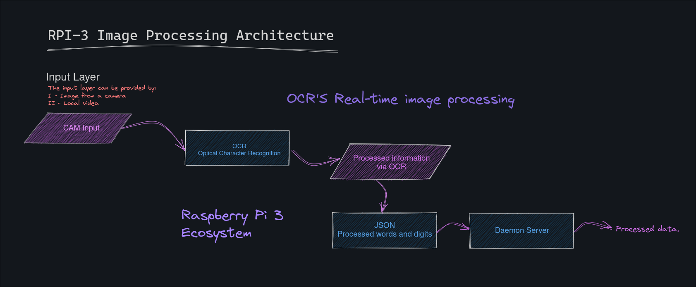

```sh
Peoples:
Author: João Leonardi da Silva Melo
Email: joao_leonardi.melo@somosicev.com
Teacher: Francisco Luciani de Miranda Vieira
Email: francisco.vieira@somosicev.com
```

<div align=center>
  <h1 align=center>LIVE HEART</h1>
  <p align=center>Real-time embedded software for optical character recognition (OCR) on hospital monitors and providing the data to an API.</p>
</div>

<!--
## OCR Basic Archtecture


## Basic Multithread Archtecture


## Basic Archtecture API

This software is in the early stages of development and currently does not have any documentation or demonstration of its usage. Please stay tuned for more information as the project progresses.


## Keras OCR
<br>Check the results at: https://github.com/rexionmars/liver-heart/tree/master/xresults


## Embedded Platform

-->

## Main characteristics 🔍
- [x] Easy use
- [X] Cross-Platform
- [X] Embedded Software
- [x] Multple Clients
- [x] Customizable to meet your needs.
## Supported platforms for upcoming versions 🛠
- [x] NVIDIA Jestson
- [x] Raspberry PI 3
- [x] ARM Cortex
- [x] Espressif
## Current limitations ⚠️
🟡 Only the English text detection has a 75% accuracy rate<br>
🟡 Parameter customization only via command-line<br>
🔴 High processing consumption, even with multi-threading<br>
🔴 Low accuracy in optical character recognition (OCR)<br>
🔴 [**Raspberry PI 3**] Tested only on **ARM Cortex-A53-based** architecture

